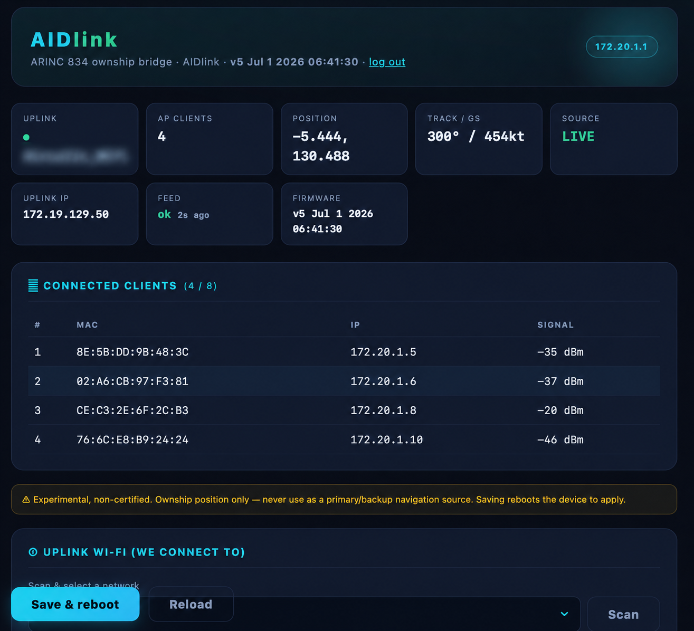

# AIDlink

**An ESP32 2.4 GHz-only Wi-Fi bridge (AP + client + NAT) with an experimental ARINC 834 ADBP position feed
for bench and interoperability testing.**

<p align="center">
  
  <br>
  <sub><i>The built-in web dashboard — live status, connected clients, Wi-Fi scan, and configuration.</i></sub>
</p>

---

## What is it for?

AIDlink is a tiny ESP32 project that does three things at once, on the bench:

1. **A 2.4 GHz-only Wi-Fi access point.** The ESP32 radio is 2.4 GHz only, so devices that join it stay off
   5 GHz — handy when you specifically want a 2.4 GHz-only hotspot.
2. **An experimental position feed.** It implements the EFB-facing side of an **ARINC 834 ADBP** interface
   and streams aircraft position to an EFB client, sourced from an HTTP endpoint that returns position data
   (see [Position sources](#position-sources)). Intended for **development and interoperability testing only.**
3. **Connection sharing (NAT).** It joins an existing upstream Wi-Fi as a client and re-shares that internet
   to everything on its own AP — one uplink, many devices.

All three run on a single ~$5 ESP32, configured from a built-in web page.

> ⚠️ **EXPERIMENTAL — NOT CERTIFIED, NOT FOR OPERATIONAL USE.** The position output has **no integrity
> guarantee**, lags reality, and must **never** be used for navigation of any kind. This is an independent
> hobby/educational interoperability project, **not affiliated with or endorsed by** any aircraft, avionics,
> EFB, airline, or connectivity provider. See [DISCLAIMER](#disclaimer-and-scope) and
> [TRADEMARKS](TRADEMARKS.md).

---

## How it works

```
[EFB / tablet] --WiFi WPA2 (2.4GHz)--> [ESP32 SoftAP 172.20.1.1/26] --NAT--> [upstream WiFi] --> Internet
        (your AP, e.g. "AIDlink")          |  ADBP server (ARINC 834): TCP 24000 + Web API HTTP 80 + mDNS
                                              |  config/status web UI on HTTP 80
                                              |  polls position from a Source URL every N seconds
                                              v
                                    ownship pushed to the EFB's data-stream port
```

- **STA (uplink):** joins an existing Wi-Fi as a client (DHCP or static).
- **SoftAP (downlink):** a WPA2, **2.4 GHz** access point at `172.20.1.1/26` (the ESP32 radio is 2.4 GHz only).
- **NAPT:** `WiFi.AP.enableNAPT(true)` — AP clients reach the internet through the uplink.
- **ADBP server:** answers the EFB Web API (for detection) and ADBP subscriptions, then streams ownship.
- **Web config + status:** `http://172.20.1.1/` or `http://aidlink.local/`.

Current firmware: **v1**.

---

## Hardware

Any common **ESP32 dev board** works — a ~$5 ESP32-DevKitC / NodeMCU-32S / WROOM-32 clone is exactly what
this was built and tested on. No extra components, shields, or wiring are needed; the board on its own
provides the radio, the config web server, and the NAT router.

### Minimum requirements

| Spec | Requirement | Notes |
|------|-------------|-------|
| **SoC** | ESP32 (Xtensa **dual-core** LX6, e.g. ESP32-D0WD) | Original ESP32 family; **not** required to be S2/S3/C3, but any ESP32 with Wi-Fi works |
| **Wi-Fi** | 802.11 b/g/n, **2.4 GHz only** | The ESP32 radio is 2.4 GHz only by design — that's the "2.4 GHz-only AP" feature |
| **Flash** | **≥ 4 MB** | Firmware is ~1.2 MB (~92% of the default 1.3 MB app partition on a 4 MB board) |
| **RAM** | 520 KB SRAM (on-chip) | Runs comfortably; ~250 KB free heap at idle |
| **USB-serial** | CH340, CP2102, or native USB | For flashing + optional serial logging; **115200** baud |
| **Buttons** | **EN** (reset) and **BOOT** (GPIO0) | Standard on dev boards; used only for manual reset / bootloader entry |
| **Power** | 5 V via USB (or 3.3 V regulated) | ~80–260 mA depending on Wi-Fi activity (AP + STA + NAT) |
| **Antenna** | PCB or external 2.4 GHz | On-board PCB antenna is fine for bench use |

### Recommended board

- **ESP32-DevKitC v4** or any **ESP32-WROOM-32 / WROOM-32E** dev board, 4 MB flash, USB-C or micro-USB.
- Confirmed working: generic WROOM-32 clone with a **CH340** USB-serial bridge.

### Board notes

- **RAM/PSRAM:** external PSRAM is **not** required.
- **Flash size:** 8/16 MB boards also work (more headroom); **2 MB boards are too small.**
- Some **CH340** boards don't auto-run firmware after flashing (esptool prints "Hard resetting" but the app
  doesn't start) — tap **EN**, power-cycle, or reboot from the host with the RTS toggle in `tools/reboot.py`.
- Serial console is **115200** baud, 8N1.

---

## Build & flash

Toolchain (offline-friendly): `arduino-cli` + **esp32:esp32 core 3.3.10**, bundled esptool, Python 3 +
pyserial. FQBN `esp32:esp32:esp32`. The sketch folder name must match the `.ino` (`firmware/aidlink/aidlink.ino`).

```bash
arduino-cli core install esp32:esp32           # one-time
arduino-cli compile --fqbn esp32:esp32:esp32 firmware/aidlink
arduino-cli upload  --fqbn esp32:esp32:esp32 -p /dev/cu.usbserial-0001 firmware/aidlink
```

`tools/flash.sh` wraps this and auto-increments the build version. The firmware stamps its build via
`#define FW_BUILD ("vNN " __DATE__ " " __TIME__)`, shown in the web header and logged at boot.

**macOS note:** esptool's config scan can hit a TCC permission error when run from under `~/Desktop` —
build/flash from a directory outside `~/Desktop` and set `ESPTOOL_CFGFILE` to an empty file (`tools/flash.sh`
does this).

---

## Configuration (web UI: `http://aidlink.local/`)

All settings persist in NVS. Key groups:

- **① Uplink Wi-Fi** — SSID/pass, DHCP toggle (shows live DHCP values read-only; uncheck for static). A **Scan** button lists nearby networks (UTF-8 SSIDs supported) to pick from.
- **② Cockpit AP** — SSID/pass, hidden flag (2.4 GHz, WPA2).
- **🆔 Aircraft identity** — tail/registration, type, Web API version (placeholders by default).
- **③ Network · DHCP · AP radio** — AP IP/mask, DHCP pool, lease, client DNS, channel, max clients,
  ADBP port (24000), data-stream port, NAT toggle, device name (→ mDNS host).
- **④ Position source** — a **provider selector** (Viasat / Panasonic / Custom·test URL), poll-interval
  slider (0.25–20 s), stale→NCD timeout. Viasat and Panasonic use their official on-board endpoints
  automatically; Custom points at your own server (Viasat JSON shape). See [Position sources](#position-sources).
- **⑤ Emulator — fixed test position** — when enabled, the source feed is **discarded** and the EFB
  receives a **fixed** position at the configured lat/lon (for bench testing).
- **🔒 Security** — enable/disable the settings login, set username, change password.
- **📡 Device traffic log** — auto-refreshing, with a live **capture** on/off toggle, Copy, and raw `/log`.

Defaults: uplink SSID blank (set it), AP `AIDlink`, AP IP `172.20.1.1/26`, ADBP `24000`,
data-stream `51000`, poll `10 s`, source **Viasat**, settings login **admin / password** (change it).

## Settings login
The web UI is protected by a clean login page (default **`admin` / `password`** — change it in the Security
card). Credentials are stored as a **salted SHA‑256** hash (never plaintext); a random `HttpOnly` session
cookie is issued, with a **"Stay connected"** option for a persistent (~30‑day) cookie that survives reboots.
The **EFB/ADBP endpoints are not gated** so the aircraft interface keeps working without login. This is a
plain‑HTTP device — the password is protected by the WPA2 link, not TLS. Forgot it? Re‑flash or erase NVS to
reset to `admin`/`password`.

---

## ARINC 834 ADBP (the protocol AIDlink speaks)

ADBP (Avionics Data Broadcast Protocol) is one of the protocols defined by **ARINC 834** (Aircraft Data
Interface Function) for exchanging avionics parameters with an EFB over IP. AIDlink implements the
EFB-facing side an Aircraft Interface Device would provide.

### Detection — HTTP Web API (port 80)
The EFB first probes `GET /getAPIVersion`; without a valid reply it reports "not detected".
Wrapper: `<Response commandName="X" returnCode="0" timestamp="ISO8601"> … </Response>`. Implemented:
`/getAPIVersion`, `/getWiFiAPStatus`, `/getAoIPStatus`, `/getAcarsStatus`, `/cmdReboot`.

### ADBP data protocol (TCP 24000, XML/UTF-8)
- **Request/response:** `getAvionicParameters` (one socket per request).
- **Continuous subscription:** `subscribeAvionicParameters` with `<publishport>` + `<refreshperiod>`;
  on-event variant; `unSubscribe` by publishport.
- **Streaming model:** the AID is the TCP **client** — it connects *to* the EFB on the advertised
  `publishport` and streams `publishAvionicParameters` over one persistent socket at `refreshperiod`.
- **Multiple EFBs:** subscriptions are deduplicated **per client IP**; `unSubscribe` matches IP+port
  (clients commonly share one publishport). Up to 6 concurrent.

### Value encoding
- **validity:** 0 ND · **1 valid** · **2 NCD (no computed data)** · 3 FT · 4 NF.
- **type:** 0 = Float64 · 3 = Float32 · 5 = Signed32 · 6 = Bool · 7 = String · 8 = Date (`YYYY/MM/DD`) · 9 = Time (`HH:MM:SS`).
- **time** = ms since 1970-01-01 UTC, from SNTP when synced.

### Streamed frame
```xml
<?xml version="1.0" encoding="UTF-8"?><method name="publishAvionicParameters" length="N"><parameters>
 <parameter name="GPSLATP" validity="1" type="0" value="43.9692" time="1782692413468"/> …
</parameters></method>
```
`length` = byte count of the `<method>…</method>` element only (excludes the prolog); the prolog is sent
on every frame; no trailing delimiter.

---

## Interoperability notes (hard-won, brand-independent)

Discovered by testing against a real EFB and reading its integration log. These are the difference between
"detected but no ownship" and a working moving-map dot:

1. **GPS position is a COARSE+FINE pair and both must share validity.** Latitude is reconstructed from
   `GPSLATP` (coarse) + `GPSLATPF` (fine); longitude from `GPSLONGP` + `GPSLONGPF`. If the fine field is NCD
   while coarse is valid, the EFB rejects the fix as a "Coarse and Fine status mismatch" and discards every
   position. → Emit the fine fields as **`validity="1" type="0" value="0.000000"`** (coarse already carries
   full precision). **Never NCD the fine fields.**
2. **Track/heading must be −180…+180, not 0…360.** Values > 180 are rejected as out-of-range. → Normalize
   (subtract 360 when > 180).
3. **City pair** (`FROMTO`) is the combined departure+arrival field — there's no separate departure
   parameter; emit it as `<origin><destination>` (e.g. `LFPGVTBS`).

Other observations: unsupported (NCD) parameters log harmlessly as "not supported"; ground speed should be
internally consistent with the position motion (AIDlink derives GS from successive fixes and clamps it to a
sane range, then dead-reckons the pushed position at 1 Hz so it advances smoothly between source updates).

---

## Position sources

Selectable in settings (④). Two on-board moving-map providers are built in, plus a custom URL:

- **Viasat** — `https://wifi.inflight.viasat.com/ac/flight/info`. Nested JSON: each field is
  `"latitude": {..., "value": "-7.98"}`. Recognized: `latitude, longitude, altitude(ft), groundSpeed(kt),
  flightNumber, tail_number, originCode, destinationCode, current_time`. (No ground speed/track in the feed →
  derived from successive fixes.)
- **Panasonic** — `http://services.inflightpanasonic.aero/inflight/services/flightdata/v1/flightdata`. Flat
  JSON with `td_id_*` keys; lat/lon are 8-digit strings = `degrees×1000` (values ≥ 80000000 are negative).
  Provides ground speed and true heading directly.
- **Custom / test URL** — point at your own server, which must return the **Viasat** JSON shape.
  See `examples/flight_info.json`.

The device picks the endpoint and parser automatically from the selected provider; the poller derives track,
clamps/derives ground speed, and dead-reckons position at the push rate for smooth motion.

---

## Logging & debugging

- The firmware mirrors a 90-line ring buffer to USB serial and to the web `/log`. Verbose detail (full
  frames, per-fix derivation) goes to serial only. A **Live capture** toggle and `logEnable` setting gate it.
- Serial commands: `L` = dump ring buffer, `C` = clear.
- `tools/tee_serial.py` opens the USB port once and tees the live serial stream to `aidlink_serial.log`
  for read-on-demand debugging without rebooting the board.
- **Success signal:** the per-connection push counter climbs past `#10` with no `unSubscribe` / client close.

---

## Repository layout

```
firmware/aidlink/aidlink.ino   # Arduino firmware (proven/shipping): WiFi/NAT, poller, ADBP, web UI
firmware/aidlink/defs.h        # Config / PosState / Sub structs
firmware-idf/                  # ESP-IDF rewrite — dual-target (esp32 + esp32s3) + USB-cable networking
firmware-idf/README.md         #   build/flash, USB-NCM cable, source layout, host tests
tools/flash.sh                 # Arduino: compile + upload (auto-version; macOS TCC-safe)
tools/tee_serial.py            # background serial logger
tools/reboot.py                # reboot the board from the host (RTS toggle)
examples/flight_info.json      # sample position-source response
LICENSE                        # Apache-2.0
```

> **Two firmwares:** `firmware/aidlink/` is the original Arduino sketch (the
> proven build). `firmware-idf/` is the ESP-IDF rewrite that additionally turns
> an **ESP32-S3's USB-C cable into a network link** (DHCP + NAT to the uplink,
> coexisting with the Wi-Fi AP) — see [`firmware-idf/README.md`](firmware-idf/README.md).

---

## License

Licensed under the **Apache License 2.0** — see [LICENSE](LICENSE) and [NOTICE](NOTICE). You may use, modify,
and redistribute it, including commercially, under the terms of that license, which also includes an explicit
patent grant. Apache-2.0 does **not** grant trademark rights — see [TRADEMARKS](TRADEMARKS.md).

## Disclaimer and scope

This project is provided for **educational and experimental** purposes, **as-is and without warranty** of
any kind (see the Apache-2.0 "Disclaimer of Warranty"). It is **not** an approved, certified, or airworthy
device, and is **not** affiliated with, endorsed by, or derived from any aircraft, avionics, EFB, airline, or
connectivity manufacturer or their documentation. It targets **ARINC 834 ADBP**, an industry interoperability
standard, purely as a descriptive reference — no claim of conformance or certification is made. The position
output is non-authoritative and must never be relied upon for navigation. You are responsible for complying
with all applicable laws and regulations and with the operating rules of any network or aircraft you connect
it to.
