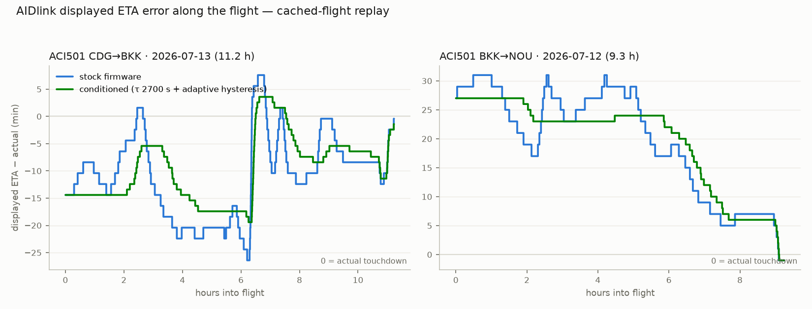

# ETA stability on real flights — cached-track replay analysis & correction plan

2026-07-15 · Replay of 12 real Aircalin flights (AeroAPI cache at
`~/.cache/onboard-ip-mock/`) through the exact firmware ETA pipeline
(`derive.c → eta.c → eta_profile.c`, poller 1 Hz + display 500 ms wiring
reproduced), in virtual time on the host. Harness: `firmware-idf/host_test/replay_eta.c`
+ `tools/extract_track.py`. Ground truth: AeroAPI `actual_on` (touchdown).



## Verdict

The displayed ETA is **not stable** on long-haul. Across 11 A339 flights
(9–12 h): 26–95 displayed changes per flight (mean 54), 5–16 direction
reversals, and a mid-flight error envelope of 20–44 min. Every change is a
±2-minute jump. Final accuracy is excellent (−2…+1 min at track end) — the
estimator converges; the path there wanders.

## Findings (ranked)

**F1 — A20N missing from perfdb (worst, and cheapest to fix).**
Aircalin's A320neo (`aircraft_type: "A20N"`) matches nothing in
`perfdb_find()`, so those flights display the reactive fallback (`eta.c`):
173 changes / 295-min span on 2.4 h YSSY→NWWW. The same flight replayed with
the existing `A320` profile: **6 changes / 6-min span**.

**F2 — the cruise-bias EMA amplifies local deviations into whole-flight swings.**
`r_ema` (τ 600 s) tracks the last ~10 min of made-good vs predicted GS and
multiplies the entire remaining cruise. On real flights r wanders 0.90↔1.08
and sits pinned at a clamp 4–18 % of the time. Freezing the bias (r≡1) cuts
changes ~3× (95→31, 46→20, 87→27) — the bias as tuned *adds* instability.

**F3 — systematic profile error drains off as slow drift.**
Even bias-frozen, errors start at −20…+31 min and glide to ~0. Two causes:
(a) seasonal 250 hPa climatology is directionally right but weak — measured
440–530 kt vs predicted 426–497 kt on the same segments (`--no-winds` spans
are 2× worse, so the climatology does help); (b) route-vs-great-circle excess:
CDG legs fly ~5 410 NM against ~5 100 NM GC, front-loaded (airway doglegs),
worth ~35 min at departure, decaying to zero. The stock `p`-scaling (bias
weight = fraction of cruise flown) correctly limits leverage but guarantees
the initial model error can never be corrected early — it must burn off as
drift the display then walks through step by step.

**F4 — display conditioning turns drift into 2-min jumps.**
`ETAP_HYST_S` 90 s > 60 s means every hysteresis trip re-rounds 1.5 min away:
the shown ETA *always* moves by 2 minutes, never 1. TOD badge churns the same
way (44–84 changes/flight).

**F5 — caveat.** The cached tracks carry ADS-B coverage gaps (1.5–5 h total,
bridged linearly by the replay exactly like `mock_server.py`), which distorts
some mid-flight kinks (e.g. the ±25 min lurch over Iran on CDG→BKK). The real
Viasat feed is gapless; absolute numbers are approximate, but all A/B
comparisons used identical inputs. Physics (winds, geometry, drift) stands.

## A339 error-budget attribution (2026-07-15, follow-up)

Method: measured true TAS from **same-day reciprocal pairs** (wind cancels),
compared perfdb climatology against actual along-track wind
(`wind_probe.c` + track GS), and replayed three counterfactuals —
adjusted-TAS, and an **oracle-winds** run whose predictor is fed the actual
future GS along the route (= unbeatable wind knowledge).

| bucket | size (mid-flight ETA effect) | adjustable? |
|---|---|---|
| Perf data: cruise TAS | DB 460 kt vs measured ~498 kt (BKK/NOU/SYD legs), ~465 kt (CDG legs) → up to ~40 min early-flight bias on BKK legs | **yes** — but route-dependent: one constant can't fit both families |
| Perf data: climb model | self-compensating (time to cover the 290 NM model climb ≈ real: ~41 vs ~41 min) | no change needed |
| Perf data: ceiling/TOD | real cruise FL370–400 (never 410); real TOD at 99–162 NM to go vs model 197 | yes — mainly fixes the TOD badge |
| Statistical winds | mean along-route error −21…+22 kt **with day-to-day sign flips on the same route**; ±3…30 min per flight; in-flight σ 8–25 kt is what the bias EMA chases | **no** (offline). Climatology already removes ~half of the raw wind effect; only live winds or the in-flight bias can do better |
| Other: route geometry | CDG↔BKK flies +300 NM vs great-circle (front-loaded) ≈ 35–45 min span — **dominates those legs; even oracle winds leave 38–46 min** | partially — needs a per-route prior, not measurable in-flight (cumulative stretch was tested and rejected) |
| Other: algorithm dynamics | bias EMA (τ 600 s) triples churn; 90 s hysteresis ⇒ every change is a 2-min jump | **yes** — validated conditioning (C2+C3): flips 10→3 |

Counterfactual replay (11 A339 flights, mean chg/flips/span):
stock 54/10/31.8 · adjusted-TAS 50/10/32.0 · **oracle winds 30/12/28.4** ·
conditioned+TAS 51/**3**/27.3.

Two entanglements to respect when correcting:
1. **TAS↔wind cancellation** — adjusting TAS alone worsened NWWW→VTBS days
   where the slow DB TAS masked a real headwind the climatology missed.
2. **wind↔geometry cancellation** — on CDG legs the climatology headwind
   error partially hides the great-circle optimism; fixing winds alone
   (oracle) *exposes* geometry (span up +10 min there).

So: ship TAS + conditioning + geometry-prior together, judged by replay over
this whole flight set, not per-flight.

## Correction plan

### Validated by replay (all 11 A339 flights) — **IMPLEMENTED 2026-07-15**

C1–C3 below are now in the firmware (C1 as a real A20N row in the Offto DB,
measured from the 2026-07-14 flight, plus A19N/A21N aliases). Post-fix
replay reproduces the prototype numbers exactly; A20N flight went from 173
changes / 295-min span to 12 / 6. See `docs/eta-estimator.md`.

| | changes | flips | span (min) | final err |
|---|---|---|---|---|
| stock | 54 × 2-min | 10 | 31.8 | −2…+1 |
| conditioned (C2+C3) | 49 × 1-min | 3 | 25.6 | −2…0 |

Cumulative displayed movement drops 108 → 49 min; reversals nearly vanish.

- **C1 — add the A20N profile.** Best ROI of all. Check Offto's SQLite for
  A320neo and regen via `tools/gen_perfdb.py`; if absent, alias A20N (and
  A21N→A321 etc.) in `perfdb_find()`'s model-match. Add a host-test case.
- **C2 — slow the bias EMA: `ETAP_BIAS_TAU_S` 600 → 2700 s.** The bias then
  tracks the route-average deviation instead of gusts. Alone: changes −22 %,
  flips −30 %, no downside observed.
- **C3 — display conditioning in `condition()`:**
  hysteresis 90 s + 60 s per hour-to-go beyond 1 h (cap 420 s), and creep the
  shown minute by ±1 toward the smoothed epoch instead of `lround` (kills the
  2-min jumps; FMS-like). Same conditioning benefits TOD partially.

### Tested and REJECTED — do not do

- **Confidence-ramp bias** (weight by observation time instead of `p`):
  span ×2–3. The local deviation is not representative of the remaining
  route; `p`-scaling is leverage control, not just confidence.
- **Cumulative route-stretch** (flown/GC ratio extrapolated to remaining):
  span up to 93 min. Route excess is front-loaded (SIDs, airway doglegs), so
  the cumulative ratio systematically overestimates the remaining route.

### Future candidates (not yet validated)

- **Live winds aloft when the internet is reachable** (`netcore_inet_up()`
  already exists): fetch 250 hPa wind for a handful of points along the
  remaining great circle (e.g. open-meteo, no key) every ~30 min, fall back
  to climatology offline. Attacks the dominant span term (F3a); expected to
  shrink the mid-flight envelope to ~±10 min.
- **Per-route learned corrections in NVS**: the device flies the same city
  pairs daily — persist last N flights' route factor (F3b) and wind residual
  per (orig, dest), seed the next flight's profile with them.

## Rerun

One-liner driver (auto-builds the C harness, prints a step table comparing
the shown ETA to the actual track and the actual touchdown, plus a summary):

```bash
tools/replay_flight.py --list
tools/replay_flight.py 2026-07-12_ACI501_VTBS            # 15-min steps
tools/replay_flight.py 2026-07-12_ACI501_VTBS --step 30 --cruise 498 --no-bias
```

Raw engine (full 500 ms series):

```bash
cd firmware-idf
clang -Imain -O2 -o /tmp/replay host_test/replay_eta.c main/eta.c \
  main/eta_profile.c main/derive.c main/geo.c main/perfdb.c \
  main/perfdb_data.c main/airports.c -lm
python3 ../tools/extract_track.py /tmp/tracks     # reads ~/.cache/onboard-ip-mock
/tmp/replay /tmp/tracks/2026-07-12_ACI501_VTBS.track.csv VTBS NWWW A339 > run.csv
```

Output columns: `t_s,dist_nm,gs_kt,mg_kt,fb_min,etap_min,tod_min,disp_min,r_ema,gt_kt`
(`disp_min` = what the screen shows). Flags: `--no-winds` / `--no-bias`
isolate the climatology and bias terms, `--cruise KT` overrides the DB
cruise TAS.
